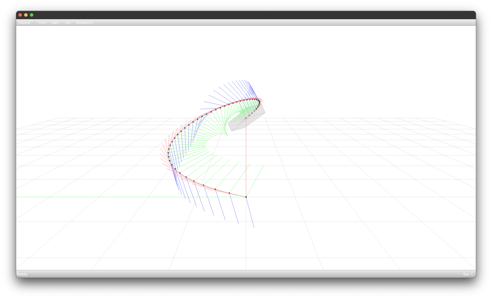

**********************************
Transporting a Box Along a Curve
**********************************

* :download:`environment.yml <environment.yml>`
* :download:`script.py <script.py>`

.. code-block:: bash

    conda env create -f environment.yml
    conda activate example-transporting-a-box-along-a-curve
    python script.py

Environment File
================

.. literalinclude:: environment.yml
    :language: yaml

Script
======

.. literalinclude:: script.py
    :language: python
